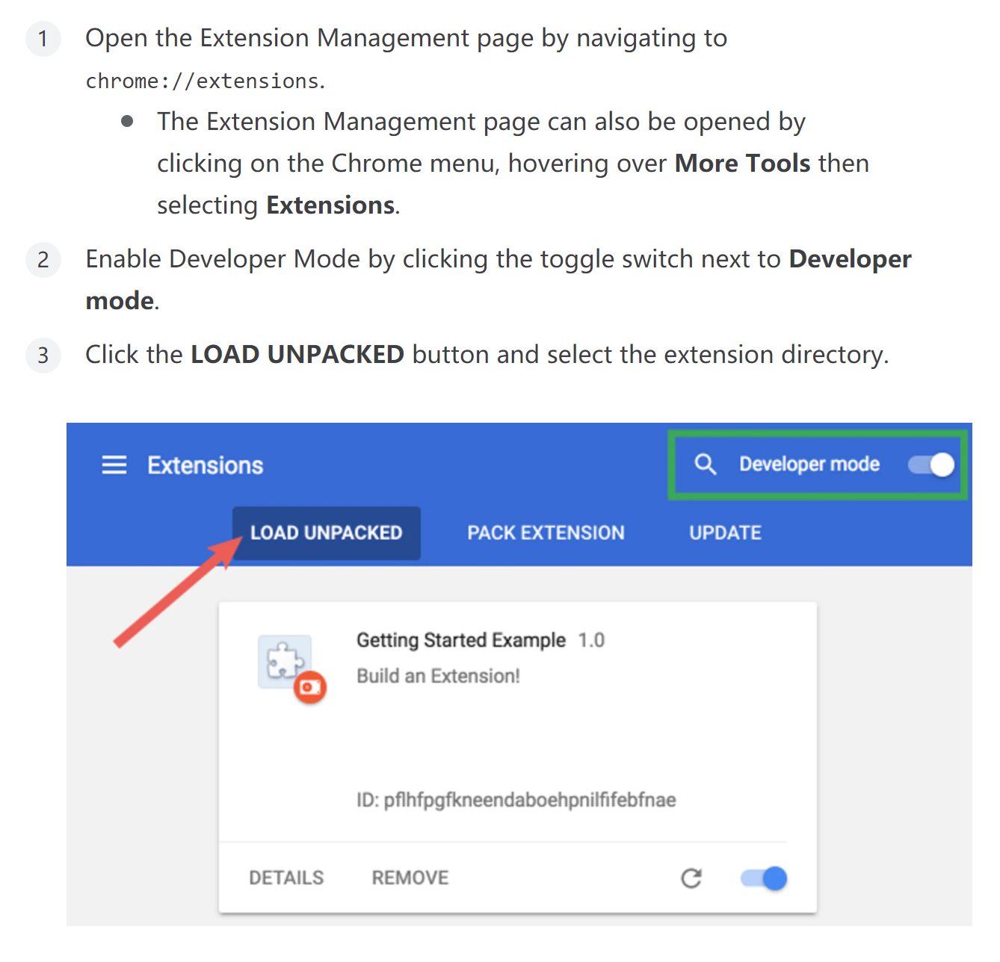

# Portal to HKU Library

## Motivation

[HKU library](https://lib.hku.hk/) provides open access to various literature databases for the staff, which is very beneficial for researchers. However, usually when I googled some keywords and interested by some paper with no open access, I need to go [Find@HKUL](https://lib.hku.hk/) or corresponding databases proxied by HKU library and search for that title again, which is quite inconvenient. What's even worse, Find@HKUL sometimes fails to find the paper.

This chrome extension is intended to ease the above process.

## Usage

1. Install this extension.
2. When you are on the abstract page of some interesting paper from some database like IEEE Xplore, ACM Digital Library, etc., just click the icon in the extension bar and you'll be redirected to the same page proxied by HKU library.
3. You may need to login with your HKU account in order to access HKU library.

## Install

This extension would be available in [Chrome Web Store](https://chrome.google.com/webstore/category/extensions) later. For now you need to install as unpacked extension in developer mode:

